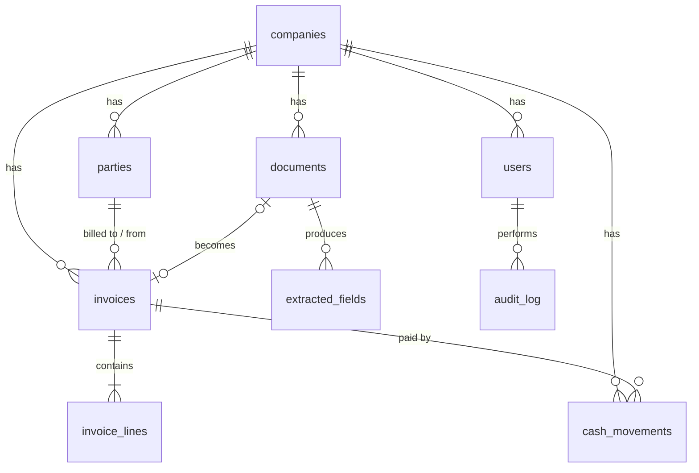

# FDG Architecture

## Data model

```mermaid
erDiagram
    companies ||--o{ parties : has
    companies ||--o{ invoices : has
    companies ||--o{ cash_movements : has
    companies ||--o{ documents : has
    companies ||--o{ users : has
    parties ||--o{ invoices : "billed to / from"
    invoices ||--|{ invoice_lines : contains
    invoices ||--o{ cash_movements : "paid by"
    documents ||--o{ extracted_fields : produces
    documents |o--o| invoices : "becomes"
    users ||--o{ audit_log : performs
```